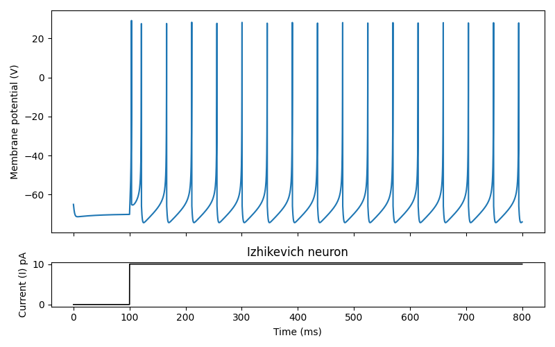
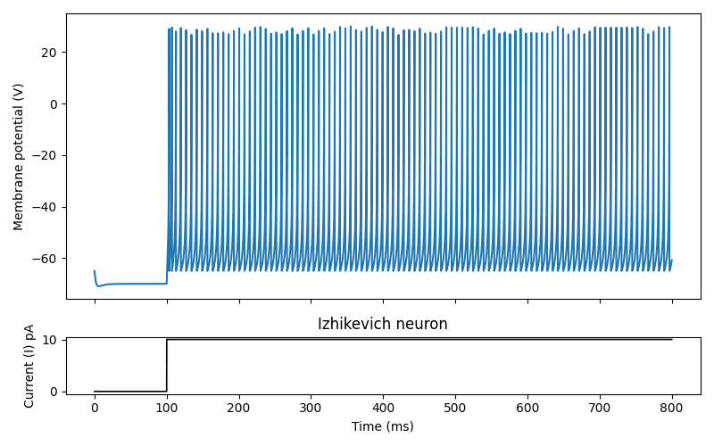
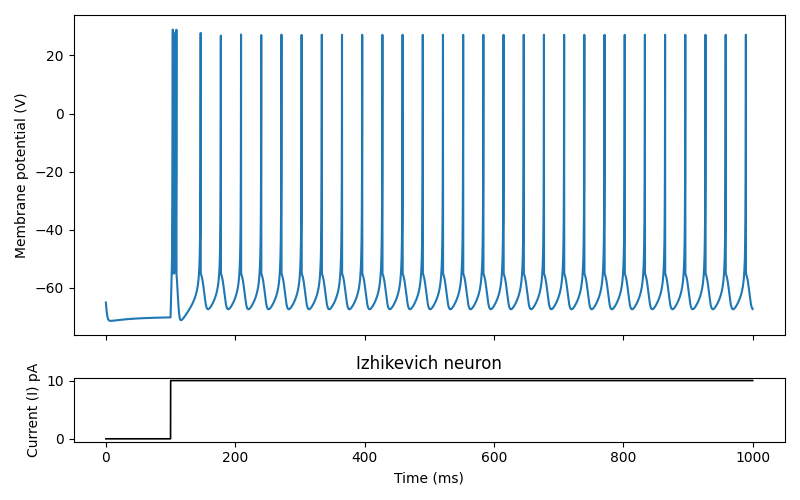
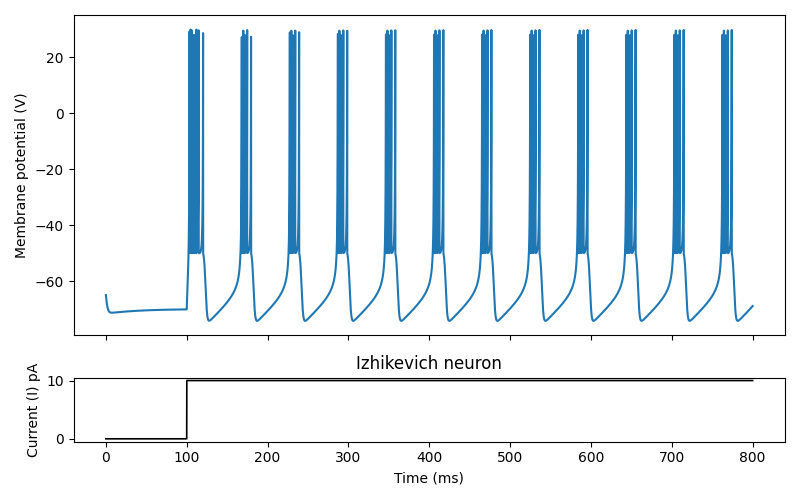
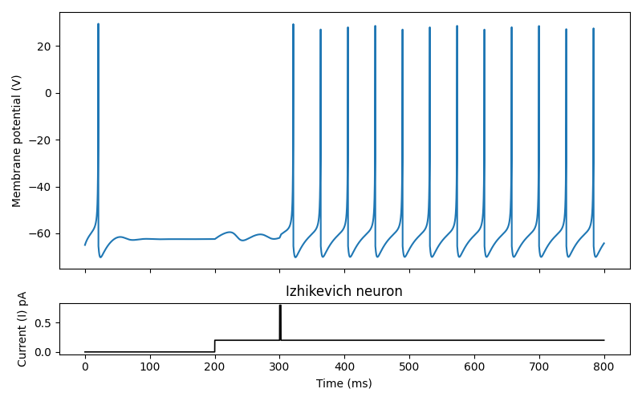
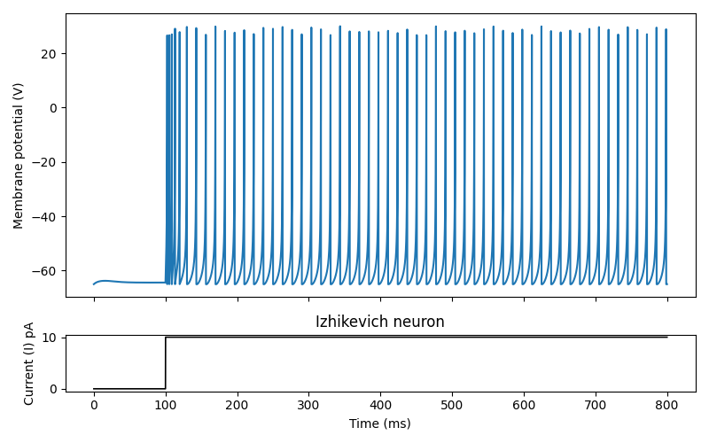
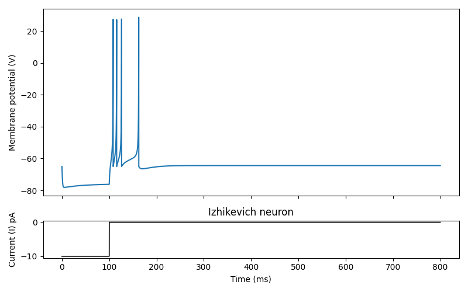

# Simple Izhikevich Neuron Simulator

A fast and efficient implementation of the [Izhikevich simple spiking neuron model](https://www.izhikevich.org/publications/spikes.htm) (2003) for exploring diverse neuronal firing dynamics. Built for students and researchers to quickly experiment with different neuron behaviors through simple YAML configuration files.

## Quick Start

### Installation

Requires Python 3.9+ and Brian2.

```bash
pip install -r requirements.txt
```

### Run a Simulation

```bash
# Both -c and --config work
python run.py -c config/rs.yaml         # Regular Spiking neuron
python run.py --config config/fs.yaml   # Fast Spiking neuron
python run.py -c config/ib.yaml         # Intrinsically Bursting neuron
python run.py -c config/ch.yaml         # Chattering neuron
python run.py -c config/rz.yaml         # Resonator neuron
python run.py -c config/lts.yaml        # Low-Threshold Spiking neuron
python run.py -c config/tc.yaml         # Thalamo-Cortical neuron
```

Each simulation displays the membrane potential and input current over time. All example configurations are in `config/*.yaml`.

<p align="center">
  
  
  
</p>

<p align="center">
  
  
  
</p>

<p align="center">
  
</p>

<p align="center">
  <em>The seven neuron types from Izhikevich (2003): RS, FS, IB, CH, RZ, LTS, TC</em><br>
  <sub>Figures produced with dt = 0.01 ms and parameter sets from config/*.yaml files</sub><br>
  <sub>Reproduce: <code>python run.py -c config/rs.yaml</code> (or any other config)</sub>
</p>

### Minimal Example

Save this as `my_neuron.yaml`:

```yaml
neuron:
  parameters:
    a: 0.02
    b: 0.2
    c: -65
    d: 8

stimulus:
  base: 0
  components:
    - kind: step
      amplitude: 10
      start_ms: 100
      duration_ms: 700

simulation:
  dt_ms: 0.01
  t_end_ms: 800
  integrator: euler
```

Run with: `python run.py -c my_neuron.yaml`

## About

This is an implementation of the [Izhikevich simple spiking neuron model](https://www.izhikevich.org/publications/spikes.htm) (2003), which uses bifurcation theory to reproduce the seven cortical neuron types shown above. The model captures spike generation as a **threshold-reset event** rather than biophysically simulating the action potential. When membrane potential reaches 30 mV, it's instantly reset - this makes the model computationally efficient while preserving biologically realistic firing patterns.

**Validation**: Parameter sets reproduce firing patterns from Figure 2 of Izhikevich (2003).

## Model Equations

```
dv/dt = 0.04v² + 5v + 140 − u + I
du/dt = a(bv − u)

if v ≥ 30 mV:
    v ← c
    u ← u + d
```

Where:
- `v` = membrane potential (mV)
- `u` = recovery variable (represents K⁺ and Na⁺ conductances)
- `I` = input current (arbitrary units, dimensionless)
- `a, b, c, d` = parameters defining neuron type

**Units**: Current values are dimensionless and scaled to match Izhikevich's original formulation (e.g., `I = 10` matches the common example used in Izhikevich (2003)). These should be interpreted phenomenologically rather than as direct electrophysiological current values. For stable spiking, `dt ≤ 0.1 ms` is recommended; `0.01 ms` is used by default in configs for accuracy.

## Expected Behaviors

| Neuron Type | Parameters | Behavior |
|-------------|------------|----------|
| RS (Regular Spiking) | a=0.02, b=0.2, c=-65, d=8 | Adapting spike frequency |
| FS (Fast Spiking) | a=0.1, b=0.2, c=-65, d=2 | High-frequency, non-adapting |
| IB (Intrinsically Bursting) | a=0.02, b=0.2, c=-55, d=4 | Stereotypical bursts |
| CH (Chattering) | a=0.02, b=0.2, c=-50, d=2 | Rhythmic burst clusters |
| RZ (Resonator) | a=0.1, b=0.26, c=-65, d=2 | Subthreshold oscillations |
| LTS (Low-Threshold Spiking) | a=0.02, b=0.25, c=-65, d=2 | Rebound spikes after inhibition |
| TC (Thalamo-Cortical) | a=0.02, b=0.25, c=-65, d=0.05 | Rebound bursts |

## How to Tell if Your Simulation Works

Spikes are registered when `v` crosses the model threshold (30 mV) and is immediately reset to `c`. Because of this reset rule, the model does not display a full biophysical action potential waveform.

**Visual and programmatic checks:**
- **Visual**: Voltage rapidly rises toward ~30 mV and then drops instantly to `c`: ✓ Correct (threshold–reset spike)
- **Visual**: Smooth, rounded peaks with no abrupt reset: ✗ Subthreshold response (no spike registered)
- **Programmatic**: Run with `--verbose` to print spike times and stimulus events; check that spike times appear when expected
- **Visual**: Gradual Hodgkin–Huxley–like action potential shape: ✗ Not applicable — this model uses threshold-reset representation
- **Troubleshooting**: If `I = 10` on an RS neuron produces no spikes, check current scaling, timestep (`dt` — use 0.01 ms for accuracy), or parameters

The Izhikevich model captures spike timing and firing patterns through reset dynamics rather than simulating the full action potential waveform.

## Runtime Verbosity

The simulator stays silent by default so you can focus on parameter exploration. Enable event logging for verification and teaching:

### Config-based (persistent)

Add to your YAML file:

```yaml
simulation:
  dt_ms: 0.01
  t_end_ms: 800
  integrator: euler
  verbose: true    # prints spike times and stimulus events
```

### CLI-based (one-time override)

```bash
python run.py -c config/rs.yaml --verbose
# or shorthand:
python run.py -c config/rs.yaml -v
```

### Write logs to file

```bash
python run.py -c config/rs.yaml -v --logfile output.log
```

This writes all event logs to `output.log` instead of the console. Useful for batch runs or saving results.

### What `--verbose` prints:

```
baseline current: 0
stimulus step 1: +10.00 from 100.0 to 800.0 ms
simulation complete: 15 spikes detected
  spike 1: 120.230 ms
  spike 2: 140.510 ms
  ...
average firing rate: 18.75 Hz
```

Useful for:
- Quick verification that spikes are detected
- Teaching demos (shows what's happening internally)
- Debugging configurations (warns if no spikes with positive current)

**Troubleshooting tip**: If you expect spikes but see none, run with `--verbose` and check the final `simulation complete: N spikes detected` line to verify spike detection is working.

## Create Your Own Neuron

Copy any config file and modify the parameters. Here's a complete configuration structure:

```yaml
neuron:
  parameters:
    a: 0.02   # Recovery time constant (smaller = slower recovery)
    b: 0.2    # Sensitivity of recovery variable to membrane potential
    c: -65    # Reset potential after spike (mV)
    d: 8      # Recovery variable increment after spike

stimulus:
  base: 0     # Baseline current (arbitrary units) - use negative for hyperpolarization
  components:
    - kind: step
      amplitude: 10      # Current amplitude (arbitrary units)
      start_ms: 100      # Start time (ms)
      duration_ms: 700   # Duration (ms)

simulation:
  dt_ms: 0.01         # Time step (ms) - smaller = more accurate
  t_end_ms: 800       # Total simulation time (ms)
  integrator: euler   # Numerical method (see below)
```

### Parameter Guide

**Neuron Parameters (a, b, c, d)**:
- `a`: Time scale of recovery variable (0.02 = typical, 0.1 = fast)
- `b`: Sensitivity to subthreshold oscillations (0.2 = typical, 0.25 = more sensitive)
- `c`: Voltage reset value (-65 mV = typical, -50 mV = high threshold)
- `d`: Outward minus inward currents after spike (2-8 = typical range)

**Stimulus**:
- `base`: Constant bias current applied throughout simulation (use negative values for inhibition)
- `components`: List of step currents (can have multiple)

### Creating Impulses

Create brief current pulses by using short `duration_ms`:

```yaml
stimulus:
  base: 0.5    # Weak baseline current
  components:
    # Brief impulse at t=200ms
    - kind: step
      amplitude: 5
      start_ms: 200
      duration_ms: 2    # Very short = impulse
    
    # Another impulse at t=400ms
    - kind: step
      amplitude: 3
      start_ms: 400
      duration_ms: 1
```

### Multiple Stimulus Components

You can combine multiple currents (see `config/rz.yaml` for example):

```yaml
stimulus:
  base: 0
  components:
    - kind: step
      amplitude: 0.2      # Sustained weak current
      start_ms: 100
      duration_ms: 600
    
    - kind: step
      amplitude: 0.8      # Brief strong pulse
      start_ms: 300
      duration_ms: 5
    
    - kind: step
      amplitude: 0.5      # Another pulse
      start_ms: 500
      duration_ms: 3
```

All components are **additive** - they sum together at overlapping times.

### Integrators

Supported numerical integration methods (all integrators supported as in Brian2):

- `euler` - Fast, less accurate (good for quick tests)
- `rk2` - 2nd-order Runge-Kutta (balanced)
- `rk4` - 4th-order Runge-Kutta (high accuracy, slower)
- `heun` - Heun's method (predictor-corrector)


## Advanced Examples

### Example 1: Testing Resonance
```yaml
# Neuron shows resonance with brief pulse on weak background
stimulus:
  base: 0
  components:
    - kind: step
      amplitude: 0.2     # Weak sustained current
      start_ms: 200
      duration_ms: 600
    - kind: step
      amplitude: 10     # Brief strong pulse
      start_ms: 300
      duration_ms: 2
```

### Example 2: Post-Inhibitory Rebound
```yaml
# Use negative baseline to hyperpolarize, then release
stimulus:
  base: -10    # Hyperpolarizing current
  components:
    - kind: step
      amplitude: 10     # Release inhibition
      start_ms: 100
      duration_ms: 700
```

### Example 3: Spike Train with Pulses
```yaml
stimulus:
  base: 3      # Near-threshold baseline
  components:
    - kind: step
      amplitude: 10
      start_ms: 100
      duration_ms: 2
    - kind: step
      amplitude: 10
      start_ms: 200
      duration_ms: 2
    - kind: step
      amplitude: 10
      start_ms: 300
      duration_ms: 2
```

## Current Limitations

- Single neuron simulations only (no network support yet)
- Step current input only (sine waves, ramps, and noise addition based on requests later)

## Contributing

We welcome contributions! If you'd like to see a feature added or have suggestions:

- **Open an issue** to discuss new features or report bugs
- **Submit a pull request** with improvements
- **Share your neuron configs** with the community

For backend modifications, see the [Developer Guide](guide/README.md).

## References

Izhikevich, E. M. (2003). Simple model of spiking neurons. *IEEE Transactions on Neural Networks*, 14(6), 1569-1572.

## License

MIT License - feel free to use for educational and research purposes.